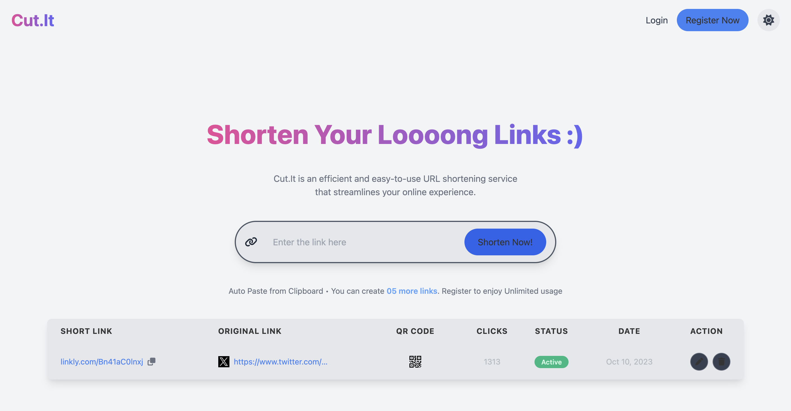
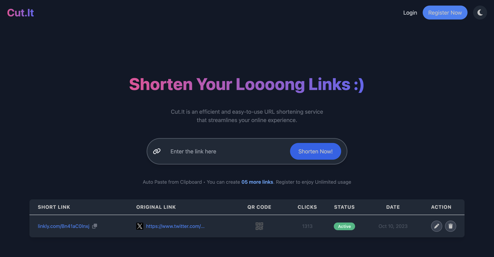
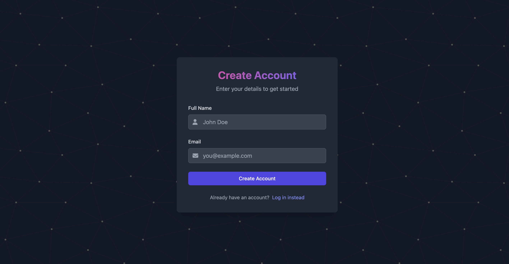

# URL Shortener: Cut.it
*A simple URL shortening tool that enables you to track counts and generate QR codes for easy access.*

- [ ] **1:** User puts the full URL in the search bar.
- [ ] **2:** Store that full URL and generate a random text or take input from the user for a unique identifier.
- [ ] **3:** Save the full URL as the value and the unique short code as the key in Redis and PostgreSQL databases. Also, store the generation date.
- [ ] **4:** Provide the user with a short URL in the format: `ourBaseUrl/ShortCode`.
- [ ] **5:** When this short URL is opened in a browser, redirect the user to the original full URL.
- [ ] **6:** Track the count of GET requests for each specific short URL.
- [ ] **7:** Offer the ability to generate a QR code that redirects to either the short URL or the original full URL.
- [ ] **8:** Include an edit option to allow users to change the unique alias (shortCode) and a delete option to remove the entry from the database.
- [ ] **9:** Provide an option to enable or disable the short URL without actually deleting it from the database.
- [ ] **10:** Implement login and registeration. We will use the same for both login and registeration. In registeration form we will ask the User for 'Name' and 'Email' we will send and OTP to mail through which user would resister and while loggin in we will use the same form to as for 'Email' and send OTP for the verification. We will have a button to resend OTP as well after 30 seconds. 
### Demo Screenshots
Light Mode | Dark Mode
:---------:|:---------:
 | 

Login | Registration
:---------:|:---------:
 | 
